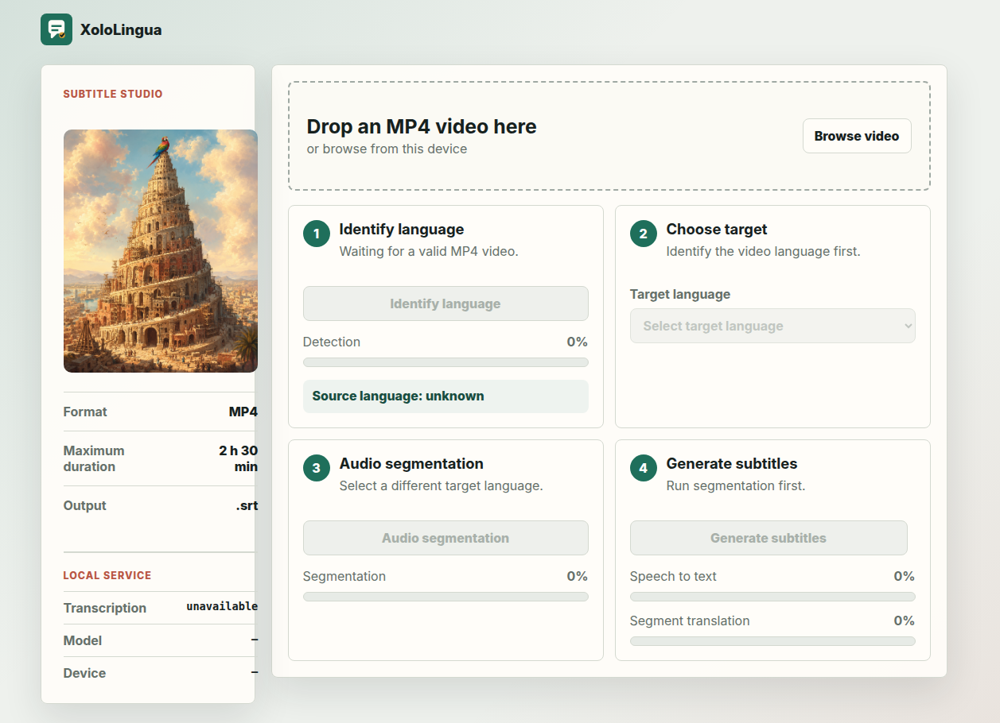
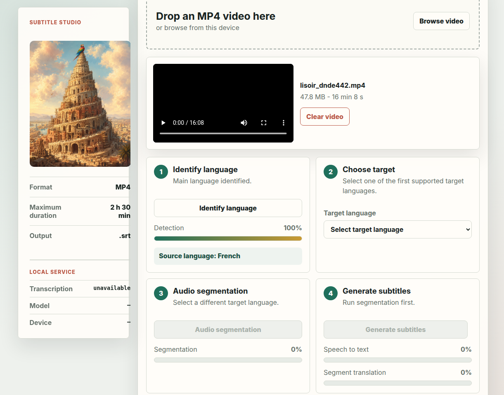
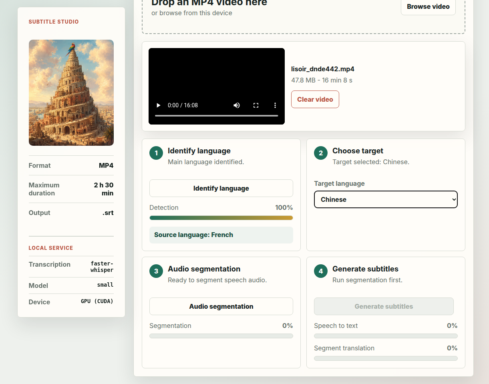
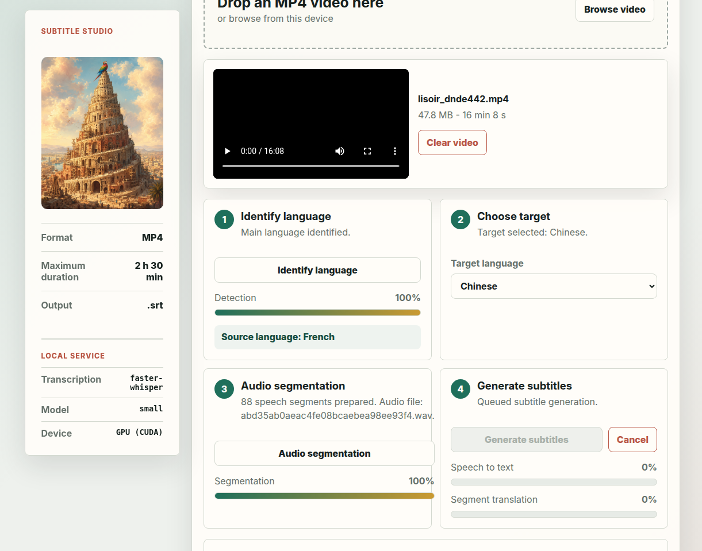
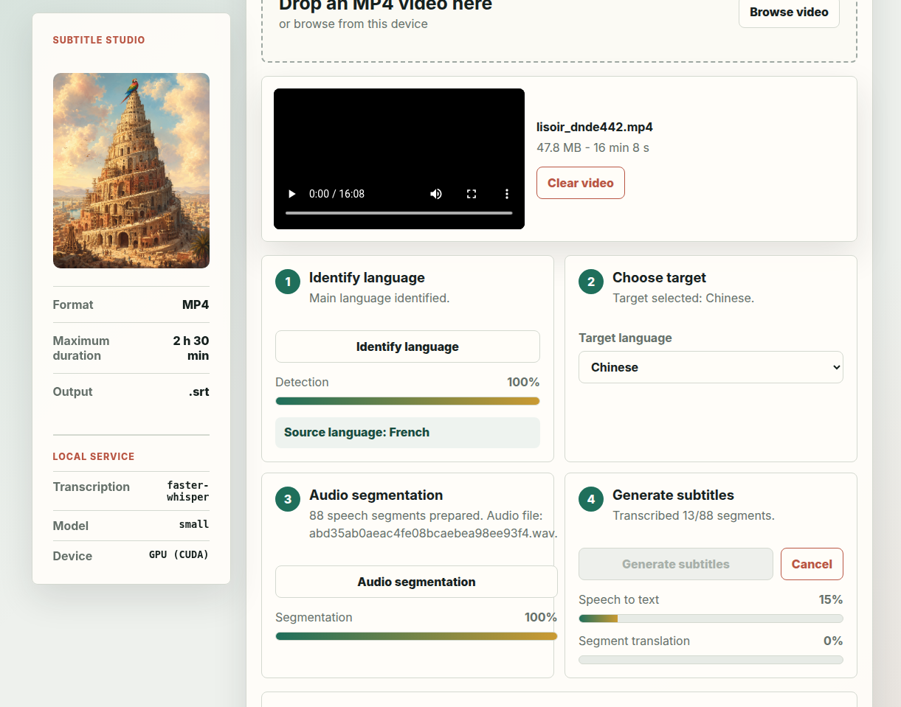
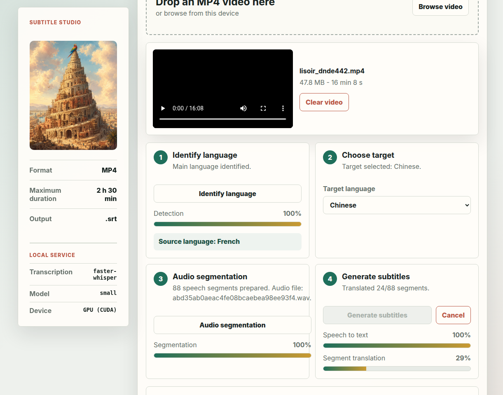
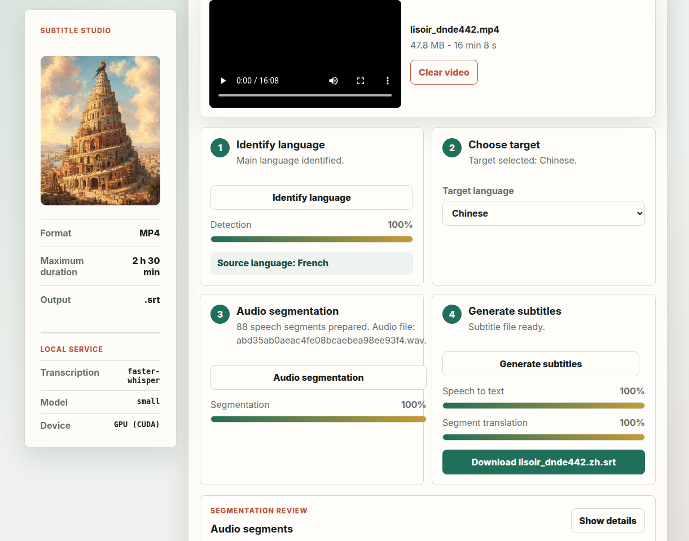

# XoloLingua

XoloLingua is a local-first Progressive Web App that creates translated `.srt` subtitles from MP4 videos. The browser provides the workflow and subtitle download, while a Python service extracts and segments audio, identifies the spoken language, transcribes speech, and translates the resulting text.

The application is currently under development and has not published its first release. It targets Chrome or Chromium on Ubuntu and can also run on Android through USB port forwarding.

## Features

- Drag-and-drop MP4 selection and video preview.
- Validation of file type and the 2 h 30 min duration limit.
- Whisper-based spoken-language identification and transcription, with CUDA support and a CPU fallback.
- Silence-based audio segmentation with a review of segment timings.
- Offline translation using locally installed Argos Translate language packages.
- Asynchronous subtitle jobs with progress reporting and cancellation.
- Downloadable, translated SRT output.
- Installable and cacheable PWA shell.

## Screenshots

<p align="center">
  
</p>

<table>
  <tr>
    <td></td>
    <td></td>
  </tr>
  <tr>
    <td align="center"><em>Identify the spoken language</em></td>
    <td align="center"><em>Select a target language</em></td>
  </tr>
  <tr>
    <td></td>
    <td></td>
  </tr>
  <tr>
    <td align="center"><em>Segment and review the audio</em></td>
    <td align="center"><em>Transcribe the speech</em></td>
  </tr>
  <tr>
    <td></td>
    <td></td>
  </tr>
  <tr>
    <td align="center"><em>Translate the segments</em></td>
    <td align="center"><em>Download the SRT file</em></td>
  </tr>
</table>

## Technology Stack

| Area | Technology |
| --- | --- |
| Web application | HTML5, CSS, and vanilla JavaScript |
| PWA support | Web App Manifest and Service Worker |
| Local API | Python 3.12 standard-library HTTP server |
| Media processing | FFmpeg and FFprobe |
| Speech recognition | `faster-whisper` / CTranslate2, on CUDA or CPU |
| Translation | Argos Translate, using its Python API with a CLI fallback |
| Packaging and commands | PDM |
| Tests | Python `unittest` |

## Architecture

```text
Chrome / Chromium (PWA, port 4173)
        |
        | HTTP / JSON and MP4 upload
        v
Local Python service (port 8765)
        |
        +-- FFmpeg: audio extraction and segmentation
        +-- faster-whisper: language detection and transcription
        +-- Argos Translate: offline segment translation
        +-- SRT generation returned to the browser
```

Processing takes place on the machine running the local service. Uploaded media and extracted audio are stored temporarily under `~/.cache/xololingua/tmp/service` by default, or under `$XOLOLINGUA_TMP_DIR/service` when that environment variable is set, rather than sent to a hosted XoloLingua backend.

### Client-side migration contract

The frontend keeps explicit capability probes for each migration stage and aggregates them through `frontend/client_pipeline_capabilities.js`:

- `audioExtraction`: browser WebCodecs or ffmpeg.wasm path, otherwise Python service fallback.
- `vad`: browser VAD path, otherwise Python segmentation fallback.
- `transcription`: browser transformers.js path, otherwise Python faster-whisper fallback.
- `translation`: browser local/cloud translator path, otherwise Python Argos fallback.

The aggregate report labels the current flow as `client-side` only when every stage has a browser runtime. Any unavailable stage produces `hybrid-fallback` with a concrete list of `serverFallbackStages`, so milestone demos can state exactly which parts still rely on the Python service. The report also exposes a `demoSummary` with readable stage labels, `serverFallbackEndpoints`, and ordered `stageRows` that pair each stage with its browser or Python fallback runtime; for example `Hybrid PWA: 2 browser stages, 2 Python fallback stages` plus `POST /api/segment-audio` for segmentation fallback, to keep the July milestone presentation aligned with the tested contract.

The ffmpeg.wasm audio-extraction prototype is intentionally bounded for milestone safety: it accepts only short videos by duration and rejects browser inputs over 100 MiB before loading the WASM runtime or copying bytes into its virtual filesystem. Browser metadata probing also fails explicitly after 10 seconds by default so stalled video headers do not leave object URLs or extraction promises hanging. The extractor exposes an opt-in `releaseAfterRun` mode that terminates/exits the ffmpeg.wasm runtime after virtual filesystem cleanup, which is useful for demo flows that process one short clip at a time and need to return the WASM heap promptly. Larger media should use the explicit Python `/api/extract-audio` fallback until a streaming/WebCodecs path is available.

## Build and Run Locally

### Prerequisites

- Ubuntu with Python 3.12 or newer.
- Chrome or Chromium.
- `ffmpeg` and `ffprobe`.
- PDM, installed through `pipx`.
- Optional: an NVIDIA CUDA-capable GPU. CPU transcription is supported but slower.

Install the system tools on Ubuntu:

```bash
sudo apt update
sudo apt install ffmpeg pipx
pipx ensurepath
pipx install pdm
```

After `pipx ensurepath`, start a new shell if `pdm` is not found.

### Install the Project

```bash
git clone https://gitlab.com/android-app-games/xololingua.git
cd xololingua
pdm install
```

PDM creates the project environment and installs `faster-whisper`, Argos Translate, and the required Python dependencies from `pyproject.toml` and `pdm.lock`.

### Install Translation Models

Argos translation packages are installed separately. For the French/English pair:

```bash
pdm run argospm update
pdm run argospm install translate-fr_en
pdm run argospm install translate-en_fr
```

Install the equivalent Argos packages for any other language pairs you want to expose. The application reads the installed pairs from the local service.

### Start the Application

Start the processing service:

```bash
pdm run service
```

In a second terminal, start the web application:

```bash
pdm run web
```

Open <http://localhost:4173>. The local service health information should appear at the top of the application; its API listens on <http://127.0.0.1:8765>.

### Configure Whisper

The service probes CUDA at startup and falls back to the CPU when necessary. Defaults are `small/float16` on the GPU and `base/int8` on the CPU. Override them with environment variables:

```bash
XOLOLINGUA_WHISPER_DEVICE=cpu pdm run service
XOLOLINGUA_WHISPER_GPU_MODEL=medium pdm run service
XOLOLINGUA_WHISPER_GPU_COMPUTE_TYPE=int8_float16 pdm run service
XOLOLINGUA_WHISPER_CPU_MODEL=small pdm run service
```

Translation uses two workers by default. Adjust the bounded worker pool when needed:

```bash
XOLOLINGUA_TRANSLATION_WORKERS=1 pdm run service
```

## Run the Tests

Run the unit and HTTP integration tests:

```bash
pdm run test
```

Tests that require FFmpeg are skipped automatically when `ffmpeg` or `ffprobe` is unavailable. Whisper and Argos are mocked in the HTTP pipeline test, so the test suite does not require a GPU or downloaded language models.

Slow E2E validators are opt-in because they use the real reference video and local models:

```bash
pdm run api-e2e --target en
XOLOLINGUA_VALIDATE_API_E2E=1 XOLOLINGUA_API_E2E_TARGET=en pdm run test
pdm run browser-e2e --target en
```

The API E2E validator auto-starts `pdm run service` when needed, uploads `/root/android-app-games/resources/lisoir_dnde442.mp4`, detects French, extracts and segments audio, creates/polls a subtitle job, and writes a verified `.srt` artifact under `~/.cache/xololingua/e2e-validations/` by default. Override that location with `XOLOLINGUA_API_E2E_OUTPUT_DIR` when a run needs an explicit artifact directory. Browser E2E downloads default to `~/.cache/xololingua/tmp/browser-e2e-downloads/`, can share another temp root through `XOLOLINGUA_TMP_DIR`, and can still be sent to an explicit directory with `XOLOLINGUA_BROWSER_E2E_DOWNLOAD_DIR`.

## Android

The frontend currently addresses the processing service at `127.0.0.1:8765`. For the complete workflow on an Android device, connect it over USB, enable USB debugging, and forward both application ports:

```bash
adb reverse tcp:4173 tcp:4173
adb reverse tcp:8765 tcp:8765
```

Then open <http://localhost:4173> in Chrome on Android. Using `localhost` also provides the secure context required to install the PWA. Merely opening the Ubuntu machine's LAN address will display the frontend but will not connect it to the processing service with the current fixed service URL.

## Repository Layout

- `index.html`, `styles.css`, and `app.js`: browser application and workflow.
- `manifest.webmanifest` and `sw.js`: PWA installation and caching.
- `local_service.py`: stable entrypoint for the local processing service.
- `xololingua_service/`: HTTP API, media processing, runtime selection, transcription, translation, and background jobs.
- `transcribe_worker.py`: isolated faster-whisper worker process.
- `tests/`: service unit and HTTP integration tests.
- `resources/`: README screenshots.
- `CHANGELOG.md`: unreleased product changes.
- `TODO.md`: remaining implementation and validation work.

## Current Limitations

- Speech segmentation is based on silence detection rather than a speech-aware model.
- Translation is limited to Argos language-pair packages installed on the service host.
- There is no hosted processing backend; the browser must be able to reach the local service.
- Browser UI tests and representative end-to-end media fixtures are still planned.

## TODO — Migration vers une architecture 100 % client

L'objectif est d'éliminer la dépendance au service Python local (`local_service.py`) afin que la PWA fonctionne sans aucune installation, directement dans le navigateur, et soit déployable sur un hébergeur statique.

### Étape 1 — Extraction audio côté client
- Remplacer l'appel `POST /api/extract-audio` (ffmpeg Python) par une extraction dans le navigateur
- Utiliser la **WebCodecs API** (native, sans dépendance) pour décoder la vidéo MP4 et extraire les trames audio, ou **`ffmpeg.wasm`** comme fallback pour les formats non couverts
- Produire un buffer PCM mono 16 kHz exploitable par les étapes suivantes

### Étape 2 — Détection d'activité vocale et découpage en segments (VAD)
- Remplacer l'appel `POST /api/segment-audio` (détection de silence ffmpeg) par une VAD dans le navigateur
- Intégrer **Silero VAD** via [`@ricky0123/vad-web`](https://github.com/ricky0123/vad) (WASM) ou équivalent
- Produire la liste de segments `{start, end}` sans aucun serveur

### Étape 3 — Transcription locale via WebGPU avec fallback WASM/CPU
- Remplacer la transcription `faster-whisper` (subprocess Python) par [`transformers.js`](https://huggingface.co/docs/transformers.js) (Xenova/Hugging Face)
- Charger un modèle Whisper directement dans un **Web Worker**
- Utiliser le backend **WebGPU** si disponible, WASM/CPU sinon (géré automatiquement par `transformers.js`)
- Couvrir également la détection de la langue source (actuellement `POST /api/detect-language`)

### Étape 4 — Traduction locale ou cloud selon le contexte
- **Option locale** : charger des modèles Helsinki-NLP via `transformers.js` dans le navigateur (aucun serveur)
- **Option cloud** : permettre à l'utilisateur de configurer un service externe (ex. LibreTranslate, DeepL) pour les paires de langues non couvertes localement

### Étape 5 — Suppression ou mise en mode optionnel du service Python
- Une fois les étapes 1 à 4 implémentées, le service Python (`local_service.py`, `xololingua_service/`) devient optionnel
- Conserver le service comme backend avancé (GPU dédié, modèles plus grands) mais ne plus en faire un prérequis
- Déployer la PWA sur un hébergeur statique (GitHub Pages, Netlify, etc.)
